# 🔐 Zero Trust Identity Lab — Step-by-Step Guide

> **Difficulty:** Beginner | **Duration:** ~2 hours | **Standard:** NIST SP 800-207

---

## Table of Contents

- [Why These Tools?](#why-these-tools)
- [The Big Picture](#the-big-picture)
- [Trust Boundary Diagram](#trust-boundary-diagram)
- [Milestone 0 — Environment Setup](#milestone-0--environment-setup)
- [Milestone 1 — Identity-Centric Connectivity](#milestone-1--identity-centric-connectivity)
- [Milestone 2 — Micro-segmentation](#milestone-2--micro-segmentation)
- [Milestone 3 — Principle of Least Privilege](#milestone-3--principle-of-least-privilege)
- [Milestone 4 — GenAI Security Co-pilot](#milestone-4--genai-security-co-pilot)
- [Check Your Understanding](#check-your-understanding)

---

## Why These Tools?

Before jumping in, it's worth understanding why this lab uses Linux Mint and Kali Linux specifically — the choice isn't arbitrary.

### Linux Mint — The Server

Linux Mint is Ubuntu under the hood. It uses the same package manager (`apt`), the same systemd service management, and the same file structure as Ubuntu Server — which runs a significant portion of real production infrastructure worldwide. The reason Mint is used as the server here rather than a plain Ubuntu install comes down to practicality: it's more forgiving for beginners, ships with sensible defaults, and behaves consistently across different hardware setups.

When you're configuring `ufw`, `sudoers`, and `nginx` for the first time, the last thing you want is the OS itself getting in the way. Mint doesn't. Every command in this guide would work identically on Ubuntu 22.04 — Mint just makes the setup experience smoother.

### Kali Linux — The Client

Kali is the industry standard for security testing and penetration testing work. It ships preloaded with tools like `curl`, `nmap`, and `netcat` that security professionals use daily — nothing needs to be installed. Using Kali as the client machine does two things at once: it puts you in the mindset of someone probing a system (which is how you think about access control), and it means the tools you need are already there.

The contrast between the two machines is also deliberate. Mint represents a hardened server you're trying to protect. Kali represents an analyst's workstation — a client that should have limited, auditable access to specific resources. That's a realistic production setup.

### Why Not Windows or macOS?

Zero Trust concepts aren't OS-specific, but the tools in this lab — `ufw`, `sudoers`, `systemctl`, `auth.log` — are Linux-native. Windows has equivalent concepts (Group Policy, Event Viewer, Windows Firewall) but they work very differently. Keeping everything in one ecosystem means you're learning the security concepts without also context-switching between two completely different operating systems.

---

## The Big Picture

### Traditional Security (Before)

```
Internet → [Firewall] → Internal Network
                              ↓
                    Everyone inside is TRUSTED
                    Free to move anywhere
```

Once an attacker gets past the firewall, they have unrestricted access to every machine, port, and file. This is called **implicit trust** — being inside the perimeter is treated as proof that you belong there. It isn't.

### Zero Trust Architecture (After)

```
Internet → [Tailscale Identity Check] → Node A
                                           ↓
                              Must prove identity for EVERY connection
                              Access restricted by ACL rules
                              Least privilege enforced at OS level
```

Every connection requires verification. Every user gets only the access their role requires. Nothing more.

> 📖 **NIST SP 800-207 Core Principle:** *"No implicit trust is granted to assets or user accounts based solely on their physical or network location."*

---

## Trust Boundary Diagram

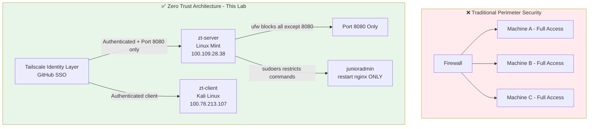

> 💡 In the traditional model, getting past the firewall means getting access to everything. In this lab's ZTA setup, every connection goes through Tailscale identity verification, port access is explicitly restricted, and even authenticated users have limited OS-level permissions.

---

## Milestone 0 — Environment Setup

### What You Need

- 2 Linux machines — this guide uses **Linux Mint** as the server and **Kali Linux** as the client
- Both machines need internet access before anything else will work

### Verify Internet Connectivity

On **Kali**, open a terminal and run:

```bash
ping google.com
```

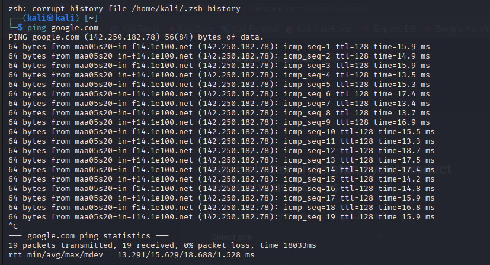

On **Linux Mint**:

```bash
ping google.com
```

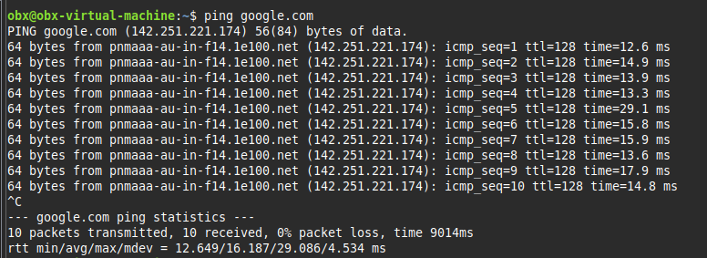

Press `Ctrl+C` to stop. Zero packet loss means you're ready to proceed.

> ✅ **Checkpoint:** Both machines have internet access.

---

## Milestone 1 — Identity-Centric Connectivity

### Concept

Traditional networks identify machines by IP address. If you know the IP, you can attempt a connection — your identity is irrelevant. Zero Trust flips this: **who you are determines what you can access**, not where you happen to be on the network.

Tailscale handles this by tying each machine to your GitHub (or Google) account, assigning a stable `100.x.x.x` IP that travels with your identity, and encrypting all traffic between nodes using WireGuard.

### Step 1 — Create a Tailscale Account

Go to [tailscale.com](https://tailscale.com) and sign up using your **GitHub account**. GitHub becomes your identity provider — the foundation of everything in this lab.

### Step 2 — Install Tailscale on Kali (Client)

```bash
curl -fsSL https://tailscale.com/install.sh | sh
```

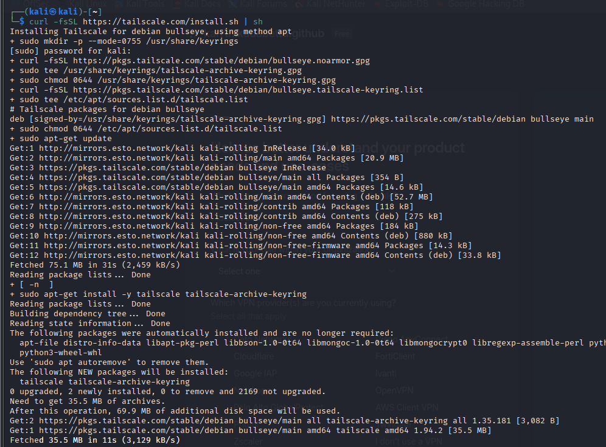

Then authenticate:

```bash
sudo tailscale up
```

You'll see a URL in the terminal:

```
To authenticate, visit:
    https://login.tailscale.com/a/xxxxxxxxxxxxxxx
```


Open that URL in your browser and log in with GitHub.

### Step 3 — Install Tailscale on Linux Mint (Server)

Same two commands on Mint:

```bash
curl -fsSL https://tailscale.com/install.sh | sh
sudo tailscale up
```

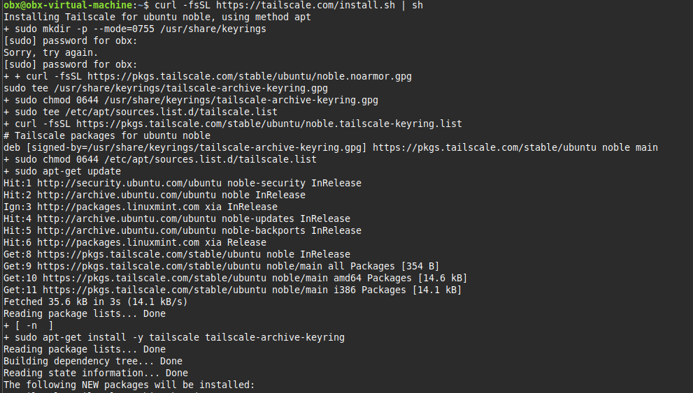

Authenticate with the **same GitHub account**. Both machines need to be under the same identity for the mesh to form.

### Step 4 — Verify the Connection

On either machine:

```bash
tailscale status
```

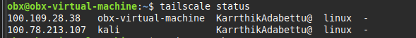

Both machines appear with `100.x.x.x` Tailscale IPs, listed under your GitHub username. This is the shift from IP-based to identity-based networking — they're connected because of *who authenticated them*, not because of their network location.

### Step 5 — Test Connectivity

From Kali, ping the Mint server using its Tailscale IP:

```bash
ping 100.109.28.38
```

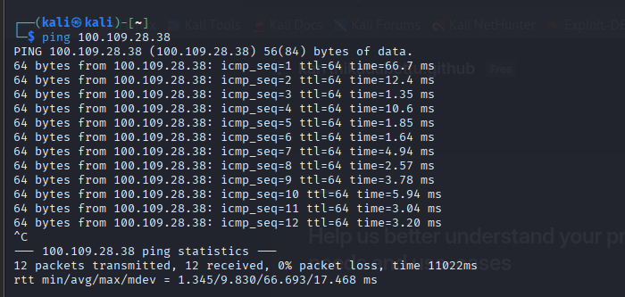

> 💡 This traffic isn't going over your local VirtualBox network. It's routed through the Tailscale mesh — authenticated, encrypted, and tied to your GitHub identity end-to-end.

> ✅ **Milestone 1 Complete:** Two machines communicating over an identity-authenticated encrypted network.

---

## Milestone 2 — Micro-segmentation

### Concept

Identity-based access gets you onto the network. But that alone isn't enough — Zero Trust also controls **what you can reach once authenticated**. Micro-segmentation means carving access into explicit, narrow zones. You're allowed to reach exactly what your role requires. Everything else is denied by default, not left open until someone blocks it.

### Step 1 — Start a Web Service on Linux Mint

```bash
python3 -m http.server 8080
```

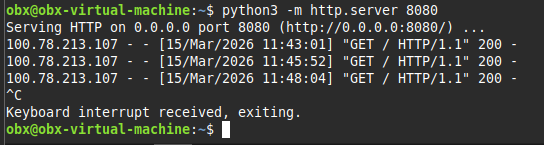

Leave this terminal running.

### Step 2 — Test Access from Kali Before Restrictions

```bash
curl http://100.109.28.38:8080
```

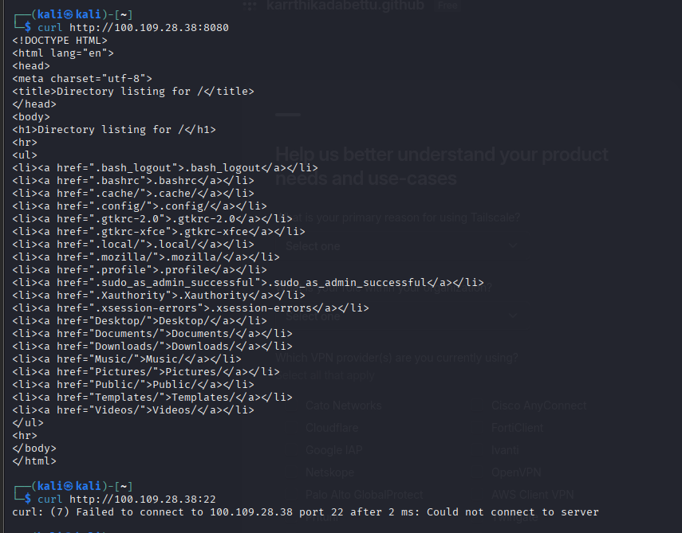

The server's home directory is completely open. This is the problem we're about to fix.

Also note port 22 before restrictions:

```bash
curl --connect-timeout 5 http://100.109.28.38:22
```

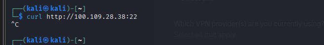

### Step 3 — Configure Tailscale ACL

Go to [https://login.tailscale.com/admin/acls](https://login.tailscale.com/admin/acls) and replace the default policy with:

```json
{
  "acls": [
    {
      "action": "accept",
      "src": ["YourGitHubUsername@github"],
      "dst": ["YourGitHubUsername@github:8080"]
    }
  ]
}
```

Click **Save**.

> 💡 This rule says: traffic from your GitHub identity going to port 8080 is accepted. Everything else is implicitly denied. That's the Zero Trust default-deny model written in JSON.

> ⚠️ **Real-world note:** On Tailscale's free single-user plan, all devices share the same owner identity, so the platform treats them as fully trusted at the network layer and some traffic like ICMP (ping) still passes through. In a production environment with multiple users and roles, Tailscale ACLs enforce this strictly. We compensate below with host-based firewall rules — which is actually how layered security works in practice anyway. No single control should be your only line of defense.

### Step 4 — Enforce Port Restrictions with ufw on Linux Mint

```bash
sudo ufw enable
sudo ufw default deny incoming
sudo ufw allow 8080/tcp
sudo ufw deny in on tailscale0
sudo ufw allow in on tailscale0 to any port 8080 proto tcp
sudo ufw status verbose
```

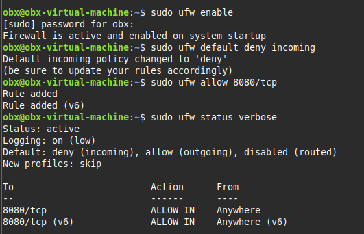

### Step 5 — Verify from Kali

```bash
# Should return HTML
curl http://100.109.28.38:8080

# Should hang and time out
curl --connect-timeout 5 http://100.109.28.38:22
```

Port 8080 returns the directory listing. Port 22 hangs silently — that silence is the firewall working. A connection that times out with no response means the packet was dropped, not rejected. Dropping is quieter and gives an attacker less information about what's running.

> ✅ **Milestone 2 Complete:** Only port 8080 is reachable. Everything else is blocked at both the ACL layer and the host firewall layer.

---

## Milestone 3 — Principle of Least Privilege

### Concept

Even authenticated users with legitimate network access should only be able to do exactly what their role requires. A junior admin who needs to restart a web server has no business reading the system password file or creating new accounts. This isn't about distrust — it's about limiting the blast radius if that account ever gets compromised.

The Principle of Least Privilege is one of the oldest and most consistently violated security concepts in real environments. This milestone makes it testable.

### Step 1 — Install nginx on Linux Mint

```bash
sudo apt install nginx -y
sudo systemctl status nginx
```

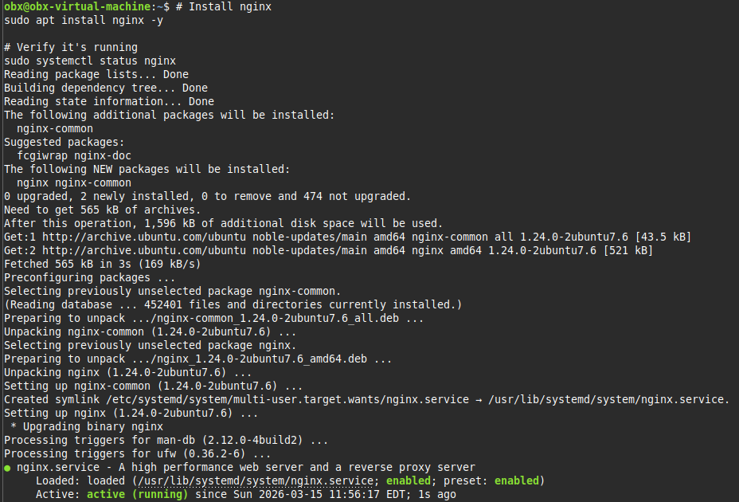

Unlike the Python HTTP server, nginx registers as a proper systemd service — it has a real name that `systemctl` can manage.

### Step 2 — Create the Junior Admin User

```bash
sudo adduser junioradmin
```

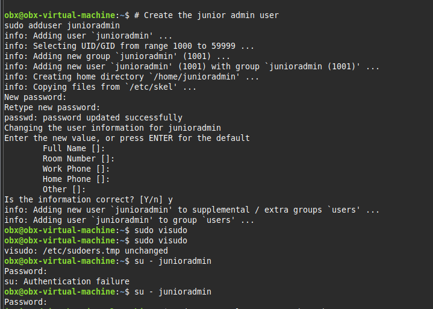

Set a password when prompted. Hit Enter through the optional fields.

### Step 3 — Write the Least Privilege sudoers Rule

```bash
sudo visudo
```

Scroll to the bottom and add this line:

```
junioradmin ALL=(ALL) NOPASSWD: /bin/systemctl restart nginx
```

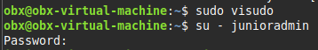

Save and exit: `Ctrl+X` → `Y` → `Enter`.

What this rule actually does:
- `junioradmin` — applies to this user only
- `ALL=(ALL)` — works from any terminal session
- `NOPASSWD:` — no password prompt for this specific command
- `/bin/systemctl restart nginx` — full path, so there's no ambiguity about which binary runs

### Step 4 — Test the Policy

Switch to junioradmin:

```bash
su - junioradmin
```

**Test 1 — The one allowed action:**

```bash
sudo systemctl restart nginx
```

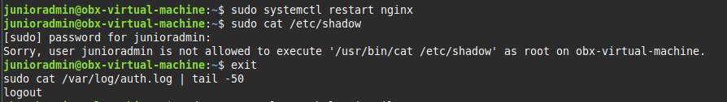

No output. No password prompt. Silent success. That's exactly right — the command ran because it's the one thing junioradmin is permitted to do.

**Test 2 — Reading a sensitive system file:**

```bash
sudo cat /etc/shadow
```

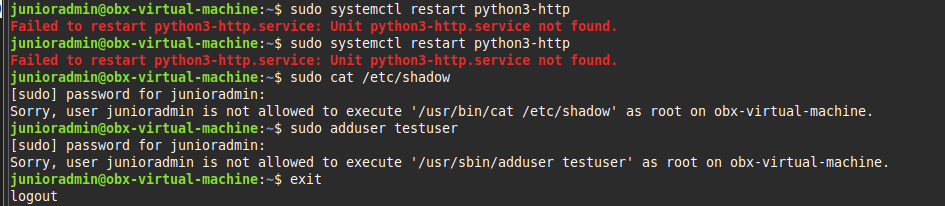

Blocked. `/etc/shadow` contains hashed passwords for every user on the system. If an attacker reads it, they can attempt offline cracking at their leisure. This file should never be accessible to a non-root account.

**Test 3 — Creating a new user:**

```bash
sudo adduser testuser
```

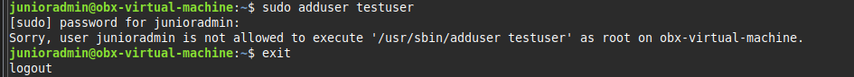

Blocked. Creating accounts is a root-level administrative action that has nothing to do with restarting a web service.

> ✅ **Milestone 3 Complete:** junioradmin can restart nginx and nothing else. The policy is written, tested, and working.

---

## Milestone 4 — GenAI Security Co-pilot

### Concept

Security logs tell the full story of what happened on a system — every login, every sudo command, every blocked attempt. The problem is volume and noise. A busy server generates thousands of log lines per hour, and finding the meaningful events manually takes time and experience that junior analysts are still building.

Generative AI changes this workflow. You feed raw logs to a model and get back a structured, plain-English analysis — flagged anomalies, explained violations, recommended follow-ups. This is increasingly how modern Security Operations Centers handle log triage, and building familiarity with this workflow early is genuinely useful.

### Step 1 — Extract the Auth Log

On Linux Mint, exit junioradmin first if still active:

```bash
exit
sudo cat /var/log/auth.log | tail -50
```

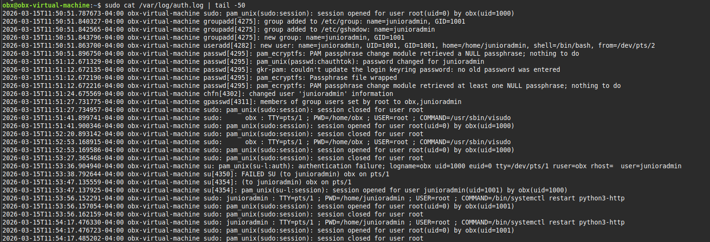

Copy the entire output.

### Step 2 — Paste Into Claude or ChatGPT

Open [claude.ai](https://claude.ai) or [chatgpt.com](https://chatgpt.com) and use this prompt:

```
You are a security analyst reviewing a Linux auth.log file.

Please analyze the following log and:
1. Identify any failed authentication attempts
2. List all privilege escalation attempts (successful and blocked)
3. Flag any commands that appear suspicious or violate least privilege
4. Summarize the security posture in plain English
5. Recommend any follow-up actions

Here is the log:

[PASTE YOUR AUTH.LOG OUTPUT HERE]
```

### Step 3 — Review the Analysis

Here is what the co-pilot analysis looks like against the auth.log generated during this lab:

---

**🔍 Co-pilot Analysis**

| Time | User | Event | Severity |
|------|------|-------|----------|
| 11:50:51 | obx | Created user junioradmin | ℹ️ Info |
| 11:53:36 | obx | Failed authentication — wrong password for junioradmin | ⚠️ Warning |
| 11:54:32 | junioradmin | BLOCKED — attempted to read `/etc/shadow` | 🚨 Alert |
| 11:54:44 | junioradmin | BLOCKED — attempted `adduser testuser` | 🚨 Alert |
| 11:57:43 | junioradmin | Restarted nginx — permitted by sudoers | ✅ Normal |
| 11:57:56 | junioradmin | BLOCKED — attempted `/etc/shadow` again | 🚨 Alert |

**Key findings:**

The `/etc/shadow` file was accessed twice by the same account. A single failed attempt could be accidental. A second attempt against the same sensitive file is a different pattern — in a real environment this would be flagged as potential insider threat activity or a sign the account has been compromised and someone is testing the policy boundaries.

The sudoers policy correctly blocked every unauthorized escalation attempt. The one permitted action — restarting nginx — executed cleanly.

One failed `su` authentication at 11:53:36 is low severity on its own, but worth watching for if it repeats.

**Recommended follow-up:**
- Set up `fail2ban` to alert on repeated sudo violations from the same account
- Add `auditd` for more granular command-level tracking beyond what auth.log captures
- Investigate why junioradmin attempted `/etc/shadow` access — even blocked attempts have intent behind them

---

> 💡 This workflow — extract logs, feed to AI, review structured analysis — is used in real SOC environments to surface what needs human attention from large volumes of raw data.

> ✅ **Milestone 4 Complete:** Real system logs analyzed using GenAI as a security auditing tool.

---

## Check Your Understanding

**1.** What is the core difference between traditional perimeter security and Zero Trust?

<details>
<summary>Show Answer</summary>
Traditional security grants implicit trust to everything inside the network perimeter — once you're in, you're trusted. Zero Trust grants no implicit trust. Every connection must be verified regardless of where it originates. Identity, not network location, determines access.
</details>

---

**2.** In the Tailscale ACL we wrote, what happens to traffic on port 22 between the two machines?

<details>
<summary>Show Answer</summary>
It is implicitly denied. Tailscale ACLs follow a default-deny model — only explicitly permitted traffic is allowed. Since only port 8080 was allowed, all other ports including SSH (22) are blocked by the policy.
</details>

---

**3.** Why did we use NOPASSWD in the sudoers rule for junioradmin?

<details>
<summary>Show Answer</summary>
Because junioradmin may need to restart nginx in automated or time-sensitive scenarios without interactive password entry. The security doesn't come from requiring a password — it comes from restricting the command to exactly one safe operation. Skipping the password prompt is acceptable here because the permitted action itself is harmless.
</details>

---

**4.** The /etc/shadow file was accessed twice by junioradmin. Why does a repeated attempt matter?

<details>
<summary>Show Answer</summary>
A single failed attempt could be a mistake. A repeated attempt against the same sensitive file suggests deliberate intent — the user is probing for privilege escalation opportunities, or the account has been compromised and an attacker is testing the policy. Repeated violations from the same account should trigger an alert in any properly configured monitoring setup.
</details>

---

**5.** What is one real limitation of the Tailscale ACL enforcement in this lab, and how was it handled?

<details>
<summary>Show Answer</summary>
On a Tailscale free single-user account, all devices share the same owner identity, so the platform treats them as fully trusted at the network layer. ICMP (ping) still passes through even with restrictive ACLs. This was handled by adding ufw rules directly on the server to enforce port-level blocking at the OS layer. Layering network ACLs with host-based firewall rules is actually best practice in production Zero Trust deployments — no single control should be the only line of defense.
</details>

---

## 🎉 Lab Complete

You've built a working Zero Trust Architecture from scratch using only free tools:

- ✅ Replaced IP-based trust with identity-based access via Tailscale and GitHub SSO
- ✅ Enforced micro-segmentation — only port 8080 reachable, everything else blocked
- ✅ Configured Least Privilege — junioradmin can restart nginx and nothing else
- ✅ Used GenAI as a real Security Co-pilot to audit live system logs

Every principle from NIST SP 800-207 has been demonstrated in a working environment, not just described on a slide.

---

## Further Reading

- [NIST SP 800-207 — Zero Trust Architecture](https://csrc.nist.gov/publications/detail/sp/800-207/final)
- [Tailscale ACL Syntax Reference](https://tailscale.com/kb/1018/acls)
- [Linux sudoers Best Practices](https://www.sudo.ws/docs/man/sudoers.man/)
- [ufw Documentation](https://help.ubuntu.com/community/UFW)
- [MITRE ATT&CK — Privilege Escalation](https://attack.mitre.org/tactics/TA0004/)
